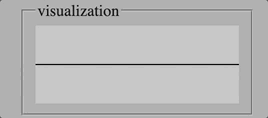

spideysynth is a playable synth using the [Web Audio API](https://developer.mozilla.org/en-US/docs/Web/API/Web_Audio_API):

The project uses jQuery to open an oscillator whenever a key is pressed. There is also a visualization of the audio wave uses an HTML Canvas element:

I built this in 2020. If I were to make a spideysynth 2.0 today, I would use React for the ability to store references to audio nodes as refs, and for the ability to handle functionality of child components in a more narrow scope. I would rebuild without jQuery.
